# PRD: Laboratório de Redação ENEM

---

## 1. Overview

**Problem Statement**
A prática de redação nas escolas ocorre majoritariamente fora de plataformas digitais, com correção predominantemente humana, gerando baixa rastreabilidade, feedback tardio e pouco personalizado, e alta carga operacional para professores. O resultado é um ciclo de aprendizagem fragmentado — sem oportunidades estruturadas de revisão e reescrita — que limita o desenvolvimento consistente da habilidade de escrita dos alunos no modelo ENEM.

**Proposed Solution**
O Laboratório de Redação é uma jornada estruturada e cíclica de aprendizagem dentro do LMS da Arco, que combina a capacidade de correção por IA já existente com um fluxo pedagógico completo: **escrever → receber feedback rápido e qualificado → revisar → reescrever**. A solução permite que escolas escalem a prática de redação sem aumentar proporcionalmente o custo ou a carga operacional, mantendo qualidade pedagógica e impacto mensurável.

**Success Metrics**

| KPI | Meta |
|-----|------|
| CSAT nota 5 | ≥ 60% |
| Clientes validados no piloto | 8 (4 SAS + 4 COC) — Q2 2026 |
| Frequência média de redações por aluno/mês | A definir com piloto |
| Tempo médio de devolutiva (ciclo IA) | A definir (benchmark atual: dias → meta: horas) |
| Taxa de reescrita (alunos que completam ciclo iterativo) | A definir com piloto |

---

## 2. Context & Background

**Why Now**
Entre 2018 e 2024, a proporção de escolas com média acima de 700 pontos na redação do ENEM cresceu mais de 5x — o mercado está em aceleração e o nível competitivo exige ferramentas mais sofisticadas. A Arco lançou em março de 2026 uma plataforma de correção de redação com IA, provando a capacidade tecnológica. O momento é de evoluir esse ativo para uma experiência pedagógica completa antes que concorrentes o façam.

**Strategic Alignment**
- Aproveita e evolui a plataforma de correção por IA já lançada (março/2026)
- Resgata aprendizados das iniciativas anteriores: Jornada COC e Laboratório de Redação SAS
- Integra-se ao Prisma/Radar, fortalecendo o ecossistema de dados da Arco
- Alinhado ao objetivo de escalar impacto pedagógico sem crescimento proporcional de custo

**User Research Summary**
Dados de escolas parceiras evidenciam:
- ~57% das escolas dedicam ~2h semanais à prática de redação na 3ª série do EM → ganhos de +37 a +52 pontos na média
- ~85% das escolas têm professores dedicados exclusivamente à redação na 3ª série
- Três motores de resultado identificados: **frequência de produção**, **feedback qualificado e ágil**, **alinhamento ao modelo ENEM**
- Professores gastam tempo excessivo com correção, sem conseguir dar feedback individual de qualidade para todos os alunos
- Gestão escolar carece de visibilidade sobre o que acontece e o impacto no aprendizado

---

## 3. Personas

| Persona | Necessidade | Dor principal | Expectativa |
|---------|-------------|--------------|-------------|
| **Aluno** | Praticar com frequência e receber feedback útil rapidamente | Espera semanas pela correção; feedback genérico | Saber onde melhorar por competência; acompanhar evolução; poder reescrever |
| **Professor** | Ampliar a prática sem multiplicar a carga de correção | Gasta muito tempo corrigindo; não consegue feedback individual para todos | Intervir onde há mais necessidade (via dados); complementar/revisar devolutivas da IA |
| **Gestão Escolar** | Garantir prática organizada e resultados mensuráveis | Falta visibilidade do que acontece e do impacto | Relatórios de evolução de turmas/escola integrados ao Prisma/Radar |
| **Marca (SAS/COC)** | Padronizar propostas e orientações pedagógicas | Criação manual e descentralizada de conteúdo | Cadastrar propostas e oficinas com configuração central |

---

## 4. Jornada do Usuário

```mermaid
flowchart LR

  subgraph TI ["🏢 Time Interno (Backoffice)"]
    TI1["Configura o Lab Redação\n—\nVincula: Ano/série · Componente Curricular\nLivro / Volume / Capítulo / Assunto\nAnexa material de orientação PDF\nDefine etapas dos ciclos"]
    TI2["Cadastra ciclos / propostas\n—\nDatas de aplicação sugeridas\nManual de orientações docente\nProposta da redação N arquivos\nMaterial de repertório"]
  end

  subgraph GS ["🏫 Gestor"]
    GS1["Visualiza detalhes\ne manual da oficina"]
    GS2["Setup da oficina na escola\n—\nDefine início do programa\nVincula professores e turmas\nDefine frequência e coleções\nConfigura liberação ao aluno\nou controle pelo professor\nConfigura validação da IA\nou entrega direta ao aluno"]
  end

  subgraph PR ["👩‍🏫 Professor"]
    PR1["Acessa as propostas\ndisponíveis"]
    PR2["Gerencia agenda de propostas\n—\nData de início das aulas\nAceita / altera datas sugeridas\nRejeita propostas\nLibera tudo de uma vez ou gradual"]
  end

  subgraph AL ["🎓 Aluno"]
    AL1["Recebe notificação\ndo agendamento da proposta"]
    AL2["Acessa materiais de apoio\ne aulas de repertório"]
    AL3["Envia redação\ntirando uma foto"]

    DEC{"Professor precisa\nvalidar a nota?"}

    HS1["Vê empty state:\ndevolutiva será liberada\napós validação do professor"]
    IA1["Aguarda retorno da IA\nestado de loading"]

    FIM["Recebe a devolutiva\ne acessa relatório\nde desempenho"]
  end

  TI1 --> TI2
  TI2 --> GS1
  GS1 --> GS2
  GS2 --> PR1
  PR1 --> PR2
  PR2 --> AL1
  AL1 --> AL2
  AL2 --> AL3
  AL3 --> DEC
  DEC -- "Sim · Modo Híbrido" --> HS1
  DEC -- "Não · Modo IA Pura" --> IA1
  HS1 --> FIM
  IA1 --> FIM
```

### Descrição dos passos

**Time Interno (Backoffice)**
1. **Configura o Lab Redação** — vincula a ano/série, componente curricular e livro/volume/capítulo/assunto; anexa material de orientação em PDF; define etapas dos ciclos.
2. **Cadastra os ciclos / propostas** — inclui datas de aplicação sugeridas, manual de orientações (apenas para docente), proposta da redação (N arquivos) e material de repertório.

**Gestor**
3. **Visualiza detalhes e manual da oficina** *(previsto para Fase 3).*
4. **Faz o setup da oficina na escola** — define início do programa; vincula professores e turmas; define frequência de atividades e coleções; configura por coleção se atividades vão direto ao aluno ou precisam de controle do professor; configura se correções da IA vão direto ao aluno ou precisam de validação do professor.

**Professor**
5. **Acessa as propostas disponíveis.**
6. **Gerencia a agenda de propostas** — define data de início das aulas; aceita ou altera datas sugeridas; rejeita propostas; decide entre liberar tudo de uma vez ou de forma gradual.

**Aluno**
7. **Recebe notificação** do agendamento da proposta.
8. **Acessa materiais de apoio e aulas de repertório.**
9. **Envia redação** tirando uma foto.

**Decisão — Professor precisa validar a nota?** *(definido no setup pelo Gestor, por coleção)*

- **Sim → Modo Híbrido:** aluno vê empty state informando que a devolutiva será corrigida e liberada somente após validação do professor.
- **Não → Modo IA Pura:** aluno aguarda o retorno da IA em estado de loading.

**Convergência**

10. Aluno **recebe a devolutiva e acessa o relatório de desempenho** (inclui evolução histórica por competência).

---

## 5. User Stories & Acceptance Criteria

### Home de Redações

*A home é a tela central de gestão do programa de redação, composta por 5 seções exibidas nesta ordem para gestores e professores.*

**US1 — Home: Status**
*Como gestor/professor, quero visualizar um painel de status com contadores das redações agrupadas por categoria para monitorar rapidamente o estado atual do programa.*

Critérios de aceitação:
- Exibe contadores de redações agrupados em 4 categorias (nesta ordem): **Atrasadas**, **Pendentes de correção**, **Corrigidas** e **Rejeitadas**
- Uma redação é considerada **atrasada** quando sua data de aplicação está há 7 dias ou mais no passado e ainda não foi corrigida nem rejeitada
- Os contadores são clicáveis e levam à lista filtrada correspondente
- Gestores visualizam um botão de configuração nesta seção que leva à tela de setup do programa de Laboratório de Redação (ausente para professores)

**US2 — Home: Próximas redações**
*Como gestor/professor, quero visualizar as próximas redações agendadas para planejar e antecipar ações necessárias.*

Critérios de aceitação:
- Exibe as próximas redações agendadas pelo time interno via backoffice
- Destaque visual maior em relação às demais seções
- Cada item exibe a coleção de origem da proposta (ex.: volume/livro/assunto vinculado)
- Mostra os 3 itens mais próximos + botão "Ver todas"

**US3 — Home: Pendentes de correção**
*Como gestor/professor, quero visualizar as redações que aguardam correção para priorizar a ação de liberar devolutivas.*

Critérios de aceitação:
- Lista redações que já foram aplicadas mas ainda aguardam correção liberada pelo professor
- Mostra os 3 itens mais recentes + botão "Ver todas"

**US4 — Home: Corrigidas / com resultados**
*Como gestor/professor, quero visualizar as redações que já tiveram correção finalizada para acompanhar o andamento das devolutivas.*

Critérios de aceitação:
- Lista redações que já tiveram correção finalizada e resultado disponibilizado ao aluno
- Mostra os 3 itens mais recentes + botão "Ver todas"

**US5 — Home: Desempenho geral**
*Como gestor escolar, quero acessar na home uma visão aprofundada de evolução por turma e por escola para embasar decisões estratégicas sem precisar navegar para outra tela.*

Critérios de aceitação:
- Visualização de desempenho médio por turma e por escola
- Breakdown por competência com % de erros mais recorrentes por turma

### Gestor

**US6 — Configuração do modelo de correção**
*Como gestor, quero configurar como cada turma será corrigida para adaptar o uso da IA à estratégia pedagógica da escola.*

Critérios de aceitação:
- 2 modos disponíveis: IA pura com liberaçã automatica para o aluno IA + validação do professor com liberação após validação
- Configuração por turma ou escola
- Possibilidade de alterar o modelo ao longo do ano

### Professor

**US7 — Gestão de agenda e propostas**
*Como professor, quero gerenciar quais propostas serão aplicadas e quando para organizar a prática das turmas.*

Critérios de aceitação:
- Visualização das propostas disponíveis cadastradas pela Marca
- Aceitar, alterar data ou rejeitar propostas sugeridas
- Liberação gradual (por etapas) ou de uma só vez
- Configuração de autonomia do aluno para visualizar propostas antecipadamente

**US8 — Validação da correção por IA**
*Como professor, quero revisar e complementar as devolutivas geradas pela IA para garantir qualidade pedagógica.*

Critérios de aceitação:
- Interface de correção com nota e comentários da IA visíveis
- Professor pode ajustar notas por competência
- Professor pode complementar feedbacks e adicionar marcações
- Professor pode sinalizar que a devolutiva foi validada individualmente ou em lote
- Aluno recebe devolutiva final consolidada após validação

### Aluno

**US9 — Envio de redação**
*Como aluno, quero enviar minha redação pela câmera do celular para receber feedback sem depender de papel ou scanner.*

Critérios de aceitação:
- Aceita foto via câmera do celular, tablet ou upload de arquivo (web)
- Folha de resposta com template não-nominal disponível para download/impressão
- No modo IA pura: exibe estado de loading enquanto aguarda o retorno da correção, com previsão de devolutiva
- No modo híbrido: exibe empty state informando que a redação será corrigida e a devolutiva liberada somente após validação do professor
- Disponível em mobile, tablet e web

**US10 — Devolutiva e relatório de desempenho**
*Como aluno, quero receber feedback estruturado por competência do ENEM e acessar meu relatório de desempenho para saber exatamente onde melhorar e acompanhar minha evolução.*

Critérios de aceitação:
- Nota e comentário para cada uma das 5 competências do ENEM
- Plano de ação com sugestões de melhoria por competência
- Relatório de desempenho acessível a partir da devolutiva, incluindo visualização de evolução histórica por competência ao longo do ano
- Aluno pode tirar dúvidas sobre a correção via plataforma

---

## 6. Requirements

### Funcionais (P0 — MVP)

**Configuração e Setup (Backoffice — Time Interno)**
- [ ] Cadastro da oficina "Lab Redação" no backoffice: vinculação a ano/série, componente curricular e livro/volume/capítulo; upload de material de orientação (PDF); definição das etapas dos ciclos
- [ ] Cadastro de propostas no backoffice com: datas de aplicação sugeridas, manual de orientações (docente), proposta da redação (N arquivos), material de repertório

**Configuração e Setup (Escola)**
- [ ] Setup do programa pela escola (Gestor): vincular professores/turmas, definir frequência de atividades, configurar por coleção se atividades vão direto ao aluno ou precisam de controle do professor, configurar se correções da IA vão direto ao aluno ou precisam de validação do professor

**Produção do Aluno**
- [ ] Notificação de proposta disponível (integração com sistema de notificações)
- [ ] Acesso a materiais de apoio e aulas de repertório
- [ ] Envio de redação via câmera (celular), upload (tablet/web) com template de folha de resposta não-nominal
- [ ] Exibição de previsão de devolutiva após envio

**Correção**
- [ ] Modo IA pura: correção automática e disponibilização direta ao aluno
- [ ] Modo híbrido: IA gera rascunho, professor valida/ajusta antes de publicar

**Devolutivas**
- [ ] Nota e feedback por competência (5 competências ENEM)
- [ ] Plano de ação com sugestões de melhoria
- [ ] Canal para dúvidas sobre a correção

**Dados e Relatórios**
- [ ] Visão de evolução do aluno por redação e ao longo do ano
- [ ] Dashboard de desempenho por turma (% erros por competência)

### Funcionais (P1 — Pós-MVP)

- [ ] Prática autônoma do aluno (low/medium/high model — além das propostas do calendário escolar)
- [ ] Comparativo entre simulados
- [ ] Benchmarking entre escolas (anonimizado)

### Não-Funcionais

| Requisito | Especificação |
|-----------|--------------|
| **Plataformas** | Mobile (iOS/Android), Tablet, Web |
| **Performance** | Tempo de processamento da correção por IA: SLA a definir |
| **Integração** | LMS Arco, sistema de agenda e notificações |
| **Segurança** | Folha de resposta não-nominal (privacidade do aluno na correção) |
| **Escalabilidade** | Suportar picos de envio (períodos de simulados) |

---

## 7. Design & User Experience

**Fluxos principais:**
1. Aluno: Recebe notificação → Acessa proposta + materiais → Envia redação → Aguarda correção (loading ou empty state conforme modo) → Recebe devolutiva e acessa relatório de desempenho
2. Professor: Acessa propostas disponíveis → Gerencia agenda → Recebe fila de validação → Revisa/complementa correções → Libera devolutiva ao aluno
3. Gestor: Faz setup da oficina (turmas, modo de correção, coleções) → Acessa home → Visualiza desempenho por turma/escola
4. Time Interno: Cadastra oficina no backoffice → Cadastra propostas com datas sugeridas e materiais

**Edge cases críticos:**
- Foto de redação ilegível: fluxo de reenvio sem penalização
- Modelo de correção alterado após alunos já terem enviado redações
- Aluno sem acesso à câmera: alternativa de upload de arquivo
- Professor não valida no modo híbrido dentro do prazo: definir regra de fallback

---

## 8. Technical Considerations

- Aproveitar a engine de correção por IA lançada em março/2026 (não reescrever)
- OCR para leitura da redação manuscrita via foto — avaliar qualidade e limites do modelo atual
- Integração bidirecional com Prisma/Radar para consolidação de dados
- Integração com sistema de agenda e notificações do LMS
- Modelo de dados que suporte múltiplas versões (reescrita) por redação
- Configuração multi-tenant: escola define regras independentemente de outras escolas

**Riscos técnicos:**

| Risco | Mitigação |
|-------|-----------|
| Qualidade do OCR em fotos de baixa resolução | Definir requisitos mínimos de câmera + guia de envio para o aluno |
| Latência da correção por IA em picos | Fila assíncrona + previsão de devolutiva exibida ao aluno |
| Divergência de dados entre LMS e Prisma/Radar | Definir contrato de integração e SLA de sincronização |

---

## 9. Implementation Plan

### Fase 1 — Piloto com protótipo (Q2 2026)
**Objetivo:** Validar hipóteses de experiência e jornada com 8 clientes (4 SAS + 4 COC) antes de investir em desenvolvimento funcional completo.

Nesta fase, a "aplicação" entregue aos clientes piloto é um **protótipo gerado por IA**, fiel ao desenho de experiência proposto no Figma, mas sem integrações funcionais reais com o LMS ou outros sistemas. O objetivo é aprender com uso real — identificar o que funciona, o que precisa ser ajustado e o que pode ser simplificado — antes de construir o produto de verdade.

- Protótipo navegável gerado por IA a partir dos designs no Figma seguindo fielmente todos os tokens e estilos definidos no design
- Cobertura das jornadas principais: aluno (envio + devolutiva), professor (validação + agenda) e gestor (home + desempenho)
- Operação manual ou semi-automatizada nos bastidores onde necessário (Wizard of Oz)
- Coleta estruturada de feedback: CSAT, entrevistas e observação de uso
- Critério de saída: CSAT nota 5 ≥ 60% e hipóteses de jornada suficientemente validadas para priorização do MVP

### Fase 2 — MVP (H2 2026)
**Objetivo:** Construir o produto funcional com as features validadas na Fase 1, priorizadas com base nos aprendizados do piloto.

- **Backoffice (Time Interno):** cadastro de oficinas e propostas no backoffice com vinculação a ano/série, componente curricular, livro/volume/capítulo, materiais de orientação, proposta da redação e material de repertório
- Setup do programa pela escola (Gestor): vincular professores/turmas, definir frequência, configurar modelo de correção por coleção (liberação direta ao aluno ou validação do professor)
- Envio de redação via câmera (celular) e upload (tablet/web) com template de folha de resposta não-nominal
- Correção nos 2 modos validados: IA pura e híbrido (IA + validação do professor)
- Devolutiva por competência + plano de ação
- Home de redações com as 5 seções (status, próximas, pendentes, corrigidas, desempenho)
- Notificações de proposta disponível
- Prática autônoma do aluno (low/medium/high model)

### Fase 3 — Ciclo de melhorias incrementais (2027+)
**Objetivo:** Evoluir o produto com base em dados de uso, expandir capacidades e aumentar impacto pedagógico mensurável.

- Visualização dos detalhes e manual da oficina para Gestor/Professor antes do setup (experiência de onboarding da oficina)
- Benchmarking entre escolas (anonimizado)
- Comparativo de desempenho entre simulados
- Predição de desempenho no ENEM com base na evolução histórica
- Demais funcionalidades priorizadas a partir dos aprendizados das fases anteriores

---

## 10. Open Questions

| # | Questão | Responsável | Prazo |
|---|---------|-------------|-------|
| 1 | Qual o SLA de correção por IA? (meta em horas) | Produto + Eng | — |
| 2 | Qual a regra de fallback quando o professor não valida no modo híbrido? | Produto + Pedagógico | — |
| 3 | A reescrita entra no mesmo ciclo ou é uma nova redação para fins de relatório? | Produto + Pedagógico | — |
| 4 | Quais métricas de frequência e reescrita serão incluídas no piloto para calibrar KPIs de fase 2? | Produto | Antes do piloto |
| 5 | O template de folha de resposta não-nominal precisa de aprovação pedagógica das marcas? | Pedagógico SAS/COC | — |
| 6 | Qual o modelo de liberação padrão de propostas quando a escola não configura? | Produto | — |
| 7 | Integração com Prisma/Radar: qual o contrato de dados mínimo para o MVP? | Eng + Dados | — |

---

## 11. Fora do Escopo

*Esta seção consolida funcionalidades e estórias despriorizadas que não devem ser endereçadas neste produto no momento.*

### User Stories fora do escopo

**US11 — Ciclo de reescrita** *(despriorizado)*
*Como aluno, quero poder reescrever minha redação após receber feedback para consolidar o aprendizado.*

Critérios de aceitação:
- Opção de reescrita disponível após recebimento da devolutiva
- Nova devolutiva gerada após reenvio
- Histórico de versões acessível (original + reescrita(s))
- Previsão de nova devolutiva exibida após reenvio

### Requisitos funcionais fora do escopo

**Correção**
- Modo professor sem IA: fila de correção digital exclusivamente humana, sem participação da IA

**Ciclo Iterativo**
- Opção de reescrita após devolutiva
- Nova devolutiva após reenvio com histórico de versões

**Integração com Prisma/Radar**
- Integração bidirecional para consolidação de dados de desempenho
- Visão comparativa e análises consolidadas via Prisma/Radar

**Funcionalidades futuras (antes categorizadas como P2)**
- Geração automática de propostas personalizadas por IA
- Sugestões de repertório baseadas em desempenho individual

---

## 12. Appendix

- Plataforma de correção por IA (lançamento março/2026) — base tecnológica
- Iniciativas anteriores: Jornada COC, Laboratório de Redação SAS
- Dados de desempenho de escolas parceiras (2018–2024)
- Matriz de competências ENEM (referência para estrutura de devolutivas)
- Documentação Prisma/Radar (integração de dados)
