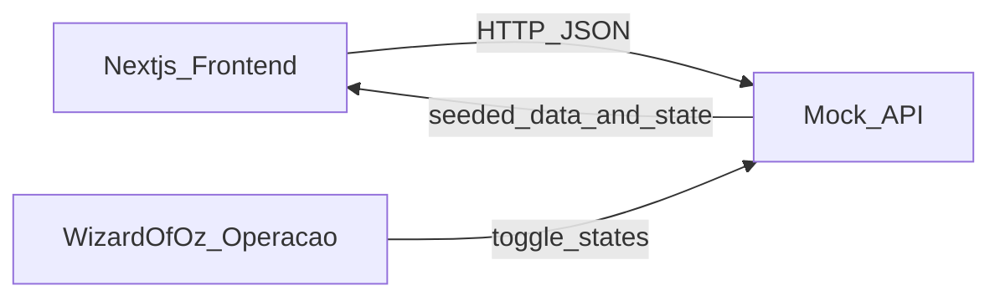

# Plano — Fase 1 (Piloto com protótipo)

## Objetivo e premissas

- **Objetivo**: entregar um **protótipo navegável** (sem integrações reais com LMS/agenda/notificações/Prisma) para liberar experiência e jornada com clientes piloto.
- **Stack decidida**: **Next.js + TypeScript** (web responsivo) + **mock API** (back-end mínimo).
- **Escopo funcional da Fase 1** (conforme PRD): cobrir jornadas principais **Aluno (envio + devolutiva)**, **Professor (liberação + agenda)**, **Gestor (home + desempenho)**, com operação manual/semi-automatizada onde necessário.
- **Fora do escopo (Fase 1)**: integrações reais (notificações, agenda do LMS, Prisma/Radar), reescrita (US11), backoffice completo (time interno) — tudo pode ser simulado via dados na mock API.

## Recorte do PRD usado

- **Fase 1**: seção "## 9. Implementation Plan → Fase 1" em `[docs/laboratorio-de-redacao-prd.md](/Users/kallewguedes/Documents/Projetos/lab-redacao-cursor/docs/laboratorio-de-redacao-prd.md)`.
- **Histórias a cobrir no protótipo**: US1–US10 em "## 5. User Stories & Acceptance Criteria".

## Figma como fonte de verdade (tokens + interfaces)

- **Interfaces (baseline)**: a implementação do protótipo deve ser balizada pelos **frames/telas do Figma** para cada persona (Aluno, Professor, Gestor), incluindo **estados** (loading, empty state, listas com/sem itens, erro "foto ilegível", etc.).
- **Tokensheet (foundations)**: usar a **tokensheet** consolidada na pasta assets, extraída a partir do Figma (cores, tipografia, espaçamentos, radius, sombras, grid) e mapear para o tema do front-end.
- **Objetivo prático**: reduzir divergência visual e acelerar desenvolvimento, garantindo que cada tela implementada "bate" com o Figma sem ajustes ad hoc.

## Arquitetura de protótipo (alto nível)

- **Front-end (Next.js)**
  - Rotas por persona: `/gestor/...`, `/professor/...`, `/aluno/...`.
  - Componentes de UI e tokens alinhados ao Figma via tokensheet (na Fase 1, o objetivo é fidelidade visual; lógica pode ser mínima).
  - Estado derivado da mock API para simular categorias/contadores/listas e transições de status.
- **Back-end (mock API)**
  - Endpoints simples para: home (status/contadores/listas), agenda/propostas, envios, correções IA (simuladas), liberação do professor, devolutiva/relatórios.
  - Capacidade de **forçar estados** (ex.: "modo híbrido", "pendente liberação", "corrigida", "rejeitada") para suportar testes em piloto.




## Backlog de tarefas (pequenas) por história de usuário

> Regra: **cada tarefa impacta apenas Front-end OU apenas Back-end**.

### US1 — Home: Status

**Front-end**

- Criar seção "Status" na Home (layout + cards contadores em ordem: Atrasadas, Pendentes, Corrigidas, Rejeitadas).
- Implementar navegação dos contadores para páginas de lista já filtradas (rota + querystring).
- ~~Exibir botão "Configuração" somente para Gestor (controle por persona).~~ → **[Atualizado]** Botão "Configurações" implementado no **header da página** do Gestor (não na seção Status), linkando para `/gestor/configurar`. Inclui ícone de engrenagem, estilo secundário (borda, fundo branco).

**Back-end**

- Endpoint `GET /home/status` retornando contadores por categoria e regra de "atrasadas" (>= 7 dias e não corrigida/rejeitada) aplicada no servidor.

### US2 — Home: Próximas redações

**Front-end**

- Criar seção "Próximas redações" com destaque visual, lista (top 3) + botão "Ver todas".
- Exibir "coleção de origem" (volume/livro/assunto) por item.

**Back-end**

- Endpoint `GET /home/proximas?limit=3` e `GET /propostas?status=agendada` com ordenação por data sugerida.

### US3 — Home: Pendentes de correção

**Front-end**

- Criar seção "Pendentes de correção" (top 3 + "Ver todas").
- Implementar página de lista filtrada "pendentes" com cards básicos (turma, proposta, data, status).

**Back-end**

- Endpoint `GET /home/pendentes?limit=3` e `GET /redacoes?status=pendente_correcao`.

### US4 — Home: Corrigidas / com resultados

**Front-end**

- Criar seção "Corrigidas" (top 3 + "Ver todas").
- Implementar página de lista filtrada "corrigidas" com link para devolutiva do aluno (simulada) e/ou visão do professor.

**Back-end**

- Endpoint `GET /home/corrigidas?limit=3` e `GET /redacoes?status=corrigida`.

### US5 — Home: Desempenho geral (Professor e Gestor)

> ⚠️ **Divergência do plano original**: a seção de desempenho foi implementada tanto para Professor quanto para Gestor (homes idênticas). O plano original previa esta seção apenas para o Gestor.

**Front-end** ✅ Implementado

- ~~Criar seção "Desempenho geral" visível apenas para Gestor.~~ → Seção implementada para **ambas as personas** (Professor e Gestor) com o mesmo conteúdo.
- **Gauge de Desempenho** (VisaoGeral): arco duplo SVG mostrando média da semana atual (verde) vs semana anterior (amarelo), com delta e ícone de tendência. Exibido no card de visão geral da home.
- **RelatorioFiltros**: chips interativos de turma ("Todas as turmas") e período ("Desde o início", 3 meses, 30 dias, 15 dias) ao lado do heading "Acompanhe o desempenho". Atualizam todos os dados da seção via URL search params (`?turmaId=&periodo=`) sem scroll-to-top.
- **Cards de métricas**: Participação (% com barra de progresso) e Desempenho médio (valor / 1.000 com barra de progresso).
- **Resultado por competência**: cards C1–C5 com nota média, tag de classificação (Desafiar/Acompanhar/Intervir) e barra de progresso.
- **EvolucaoChart interativo**: gráfico de barras com dois seletores — (1) nota (Nota final, C1–C5) e (2) agrupamento (Semanas, Meses, Bimestres, Trimestres). Re-agrega dados no client-side. Eixo Y dinâmico: máximo 1.000 para nota final, 200 para competências.

**Back-end** ✅ Implementado

- ~~Endpoint `GET /dashboard/desempenho`~~ → Funcionalidade distribuída em dois endpoints:
  - `GET /home/overview` → retorna contadores + `desempenhoAtual`, `desempenhoAnterior`, `delta` (médias agrupadas por semana a partir de `evolucoes[].historico`).
  - `GET /home/relatorio?turmaId=&periodo=` → retorna `participacaoMedia`, `desempenhoMedio`, `competencias[]`, `pontos[]` (dados brutos para re-agregação client-side), `turmas[]` (para popular o filtro). Filtra por turma e por janela temporal.

### US6 — Gestor: Configuração do modelo de correção

**Front-end** ❌ Pendente

- Criar tela "Setup/Configuração" acessível via botão "Configurações" no header do Gestor (rota `/gestor/configurar`).
- Implementar escolha de modo: IA pura vs híbrido (liberação do professor), por turma (ou escola) e possibilidade de alteração.

**Back-end** ✅ Implementado (parcialmente)

- Endpoints `GET /configuracao` e `PUT /configuracao` para armazenar modo por turma/escola.
- Regra no servidor para que o modo influencie o status pós-envio (IA pura → "corrigindo"; híbrido → "aguardando_liberacao").

### US7 — Professor: Gestão de agenda e propostas

**Front-end** ✅ Implementado — rota `/professor/propostas`

- **Lista semanal**: propostas agrupadas por semana (segunda-feira como âncora), semana atual destacada em azul. Cada proposta exibe coleção (cor + inicial), título e status computado.
- **Status computado client-side**: `oculto` (data futura) / `visível` (semana atual) / `atrasada` (semana passada) / `falta corrigir` (redações aguardando liberação) / `corrigida` (todas corrigidas) / `descartada`.
- **Filtros**: coleção (select), período (Próximas / Todas / intervalo livre com inputs date), status (multi-select com checkboxes e label resumido). Pré-aplicados via `?origem=proximas|pendentes|corrigidas`.
- **Alterar data unitário**: botão calendário por item abre drawer lateral com datepicker.
- **Alterar data em lote**: modo seleção → botão "Alterar datas (N)" → drawer com todas as propostas selecionadas e datepicker individual para cada uma.
- **Descartar unitário**: botão lixeira faz `PATCH { status: 'descartada' }` imediato.
- **Descartar em lote**: modo seleção → botão "Descartar (N)" → PATCH em paralelo para todos.
- **Drag and drop**: arrastar item pelo handle para semana-alvo reagenda via `PATCH { dataAgendada }`. Outline dashed na zona de drop. Drag bloqueado em modo de seleção.
- **Navegação inteligente**: click no item navega para `?aba=resultados|correcao|proposta` conforme status.
- ~~Toggles "liberação gradual / autonomia do aluno"~~: não implementados nesta tela (fora do escopo atual).

**Back-end** ✅ Implementado

- `GET /api/propostas` — lista todas as propostas com coleção populada.
- `PATCH /api/propostas/:id` — persiste alterações de `dataAgendada` e `status`.
- `GET /api/redacoes` — usado client-side para calcular estatísticas de correção por proposta.

### US8 — Professor: Validação da correção por IA

**Front-end**

- Criar fila de liberação do professor (lista de redações "aguardando liberação").
- Criar tela de correção: exibir nota/comentários da IA por competência; permitir ajustar nota; editar/complementar feedback.
- Implementar botão "Liberar notas" que libera todas as redações da proposta de uma vez.

**Back-end**

- Endpoints `GET /redacoes?status=aguardando_liberacao` e `GET /redacoes/:id/correcao_rascunho`.
- Endpoint `PUT /redacoes/:id/liberacao` persistindo ajustes e publicando devolutiva final.

### US9 — Aluno: Envio de redação

**Front-end**

- Criar tela do aluno para proposta + envio (mobile-first): captura/seleção de imagem + upload.
- Implementar download do "template não-nominal" (link/arquivo estático no protótipo).
- Implementar estados pós-envio:
  - IA pura: loading com "previsão de devolutiva".
  - Híbrido: empty state "aguardando liberação do professor".

**Back-end**

- Endpoint `POST /redacoes/envio` aceitando upload (mock: armazenar metadados/arquivo local/placeholder) e retornando status inicial.
- Endpoint `GET /redacoes/:id/status` para o front-end fazer polling e simular progresso.
- Endpoint `GET /assets/template-folha-resposta` servindo o template (ou instruir FE a servir estático e o BE apenas referenciar).

### US10 — Aluno: Devolutiva e relatório de desempenho

**Front-end**

- Criar tela "Devolutiva" com 5 competências (nota + comentário) e "plano de ação" por competência.
- Criar tela "Relatório" com evolução histórica por competência ao longo do ano (gráfico simples) acessível a partir da devolutiva.
- Criar "canal de dúvidas" (UI: form/chat-like) ligado à redação.

**Back-end**

- Endpoints `GET /redacoes/:id/devolutiva` e `GET /alunos/:id/evolucao` (série histórica por competência).
- Endpoint `POST /redacoes/:id/duvidas` armazenando mensagens (mock) para demonstrar o canal.

---

## Entregas adicionais (fora do escopo original do plano)

> Implementações realizadas além do PRD original, incorporadas durante o desenvolvimento.

### NavTabs — Navegação sticky interna

- Barra sticky (`position: sticky; top: 0`) com três abas: **Visão geral**, **Atividades**, **Resultados**.
- Click rola suavemente até a section correspondente com offset compensando a altura da barra (56px via `scrollMarginTop`).
- Aba ativa atualiza automaticamente conforme scroll (listener no container `<main>`).
- Alinhamento: wrapper ocupa 100% da largura; tabs se restringem a `maxWidth: 1042` + `margin: auto`, alinhadas com o conteúdo das sections.
- **Arquivo**: `src/components/NavTabs.tsx`

### Header redesenhado (Professor e Gestor)

Implementado com base no frame Figma `399-31213`:

- **Breadcrumb** "← Atividades" (chevron-left SVG + link, cor `#0079ce`, 14px/500) com `marginBottom: 24px`.
- **Título** "Laboratório de redação" (28px/600/`#232831`/`letterSpacing: -0.2px`).
- **Caption** "Propostas novas toda a semana para praticar." (16px/400/`rgba(0,0,0,0.5)`/`lineHeight: 1.5`).
- **Gestor only**: botão "Configurações" (ícone de engrenagem SVG 20×20, fundo branco, borda `#abb3c4`, `borderRadius: 8`, `16px/500/#626c80`), link para `/gestor/configurar`.
- **Professor**: sem botão de configuração.
- **Arquivos**: `src/app/professor/page.tsx`, `src/app/gestor/page.tsx`

### Imagens dos cards de proposta

- Campo `imageUrl` nas propostas populado com imagens locais (em `public/images/`).
- **Pratique Redação** (`col-pr-*`, `col-1`): `/images/pratique-redacao.jpg`
- **Livro I** (`col-l3-*`, `col-2`, `col-3`): `/images/livro3.png`
- Lógica de atribuição por `colecaoId` aplicada diretamente no seed (`src/data/seed.ts`).

### Dados seed: renomeação de coleções

- Todas as coleções "Livro III" renomeadas para **"Livro I"** no seed.
- IDs internos (`col-l3-*`, `col-2`, `col-3`) mantidos inalterados.

---

## Tarefas transversais (necessárias para o protótipo funcionar)

**Front-end**

- Usar o tokensheet extraído do figma e salvo em /assets para configurar tema (CSS variables/Tailwind/typography/spacing/radius/shadows)
- Extrair do figma os elementos e construir o front-end com altíssima fidelidade.
- Consolidar "baseline de interfaces" do Figma: lista de telas/frames e estados obrigatórios por jornada (Aluno/Professor/Gestor), usada como checklist de implementação. ❌ Pendente (documento formal não gerado)
- Implementar "seletor de persona" (somente no protótipo) para navegar como Gestor/Professor/Aluno.
- Criar componentes base reutilizáveis (cards, lista, tabs, estados vazios/loading) alinhados ao Figma.
- Implementar camada de client (`fetch`) e tipagem de responses (TypeScript) para a mock API.

**Back-end**

- Definir modelos e dados seed (propostas, turmas, alunos, redações, competências, devolutivas) cobrindo todos os estados.
- Implementar "painel Wizard-of-Oz" (endpoint(s) admin) para alternar rapidamente estados durante demos (ex.: marcar redação como corrigida, forçar erro/ilegilível, mover para liberação).

## Critérios de pronto (Fase 1)

- Protótipo navegável cobrindo as 3 jornadas citadas no PRD.
- Telas-chave renderizam com fidelidade visual ao Figma (tokens/estilos) e estados simulados coerentes.
- Mock API permite demonstrar todos os fluxos sem dependências externas.

## Riscos e como mitigar no protótipo

- Latência IA/OCR: simular via polling e tempos configuráveis no mock API.
- Edge cases (PRD seção 7): incluir flags no mock API para demonstrar "foto ilegível", "sem câmera (upload)", "modo alterado após envio".

---

## Ordem de implementação das tarefas

> **Princípio**: cada tarefa deve ser verificável de forma isolada antes de avançar para a próxima etapa.
> Tarefas dentro de uma mesma etapa podem ser executadas em paralelo.
> As dependências estão listadas explicitamente em cada item.

---

### Etapa 0 — Concluída

| # | Tarefa | Tipo | Arquivo |
|---|--------|------|---------|
| 0 | Extração da tokensheet do Figma | FE | [`figma-tokensheet-extraction.md`](tasks/figma-tokensheet-extraction.md) |

**Status**: ✅ Feito em 2026-04-07. Tokens disponíveis em `/assets/tokens.json`, `/assets/tokens.css` e `/assets/tokens.html`.

---

### Etapa 1 — Fundação (paralelo)

> Tarefas sem dependência de código. Desbloqueiam todas as etapas seguintes.

| # | Tarefa | Tipo | Arquivo | Depende de | Status |
|---|--------|------|---------|------------|--------|
| 1 | Baseline de interfaces do Figma | FE | [`figma-interfaces-baseline.md`](tasks/figma-interfaces-baseline.md) | — | ❌ Pendente |
| 2 | Modelos de dados e seeds da mock API | BE | [`mock-api-models-seed.md`](tasks/mock-api-models-seed.md) | — | ✅ Concluído |
| 3 | Rotas por persona e navegação base | FE | [`define-routes-personas.md`](tasks/define-routes-personas.md) | Etapa 0 (tokens) | ✅ Concluído |

#### Como testar cada tarefa individualmente

**Tarefa 1 — Baseline de interfaces**
- Critério: documento gerado listando todas as telas/frames por persona (Aluno, Professor, Gestor) com estados obrigatórios (loading, empty, erro, com dados).
- Teste: revisar o checklist e confirmar que cada jornada do PRD (US1–US10) tem ao menos uma tela mapeada.

**Tarefa 2 — Modelos e seeds**
- Critério: script de seed roda sem erros e popula os modelos com dados de exemplo cobrindo todos os estados relevantes (`pendente`, `corrigindo`, `aguardando_liberacao`, `corrigida`, `rejeitada`, `ilegivel`).
- Teste: após rodar o seed, executar queries básicas nos modelos e verificar que cada estado possui ao menos um registro.

**Tarefa 3 — Rotas e navegação base**
- Critério: aplicação Next.js inicia (`npm run dev`) e exibe o seletor de persona na raiz. Navegar para `/gestor`, `/professor` e `/aluno` renderiza a home correspondente (pode ser placeholder).
- Teste: acessar as 3 rotas no browser e confirmar que cada uma exibe o nome da persona e tokens CSS aplicados (fundo, tipografia).

---

### Etapa 2 — Camada de API (paralelo, após Tarefa 2)

> Endpoints da mock API. Podem ser desenvolvidos e testados via HTTP antes do front-end.

| # | Tarefa | Tipo | Arquivo | Depende de | Status |
|---|--------|------|---------|------------|--------|
| 4 | Endpoints de home, propostas e redações | BE | [`api-endpoints-home-propostas-redacoes.md`](tasks/api-endpoints-home-propostas-redacoes.md) | Tarefa 2 | ✅ Concluído |
| 5 | Endpoints de correção e liberação | BE | [`api-endpoints-correcao-liberacao.md`](tasks/api-endpoints-correcao-liberacao.md) | Tarefa 2 | ✅ Concluído |
| 6 | Painel Wizard-of-Oz (admin de estados) | BE | [`wizard-of-oz-admin.md`](tasks/wizard-of-oz-admin.md) | Tarefa 2 | ✅ Concluído |

#### Como testar cada tarefa individualmente

**Tarefa 4 — Endpoints de home, propostas e redações**
- Critério: todos os endpoints respondem com dados do seed e status HTTP correto.
- Teste (curl/Postman):
  ```
  GET /home/status              → contadores corretos por categoria
  GET /home/overview            → contadores + desempenhoAtual, desempenhoAnterior, delta
  GET /home/proximas?limit=3    → 3 propostas agendadas
  GET /home/pendentes?limit=3   → 3 redações pendentes de correção
  GET /home/corrigidas?limit=3  → 3 redações corrigidas
  GET /home/relatorio           → participacaoMedia, desempenhoMedio, competencias, pontos, turmas
  GET /home/relatorio?turmaId=turma-1&periodo=30 → dados filtrados por turma e período
  GET /propostas?status=agendada → lista completa
  GET /redacoes?status=pendente_correcao → lista completa
  ```
- Verificar: a regra "atrasada" (>= 7 dias sem correção) é aplicada no servidor e aparece no contador.

**Tarefa 5 — Endpoints de correção e liberação**
- Critério: fluxo completo de envio → rascunho IA → liberação → devolutiva funciona via API.
- Teste (curl/Postman):
  ```
  POST /redacoes/envio           → retorna id e status inicial
  GET  /redacoes/:id/status      → reflete estado atual
  GET  /redacoes/:id/correcao_rascunho → notas e comentários por competência
  PUT  /redacoes/:id/liberacao   → persiste ajuste e publica devolutiva
  GET  /redacoes/:id/devolutiva  → devolutiva final disponível
  GET  /alunos/:id/evolucao      → série histórica por competência
  POST /redacoes/:id/duvidas     → armazena mensagem
  GET  /configuracao             → modo atual por turma/escola
  PUT  /configuracao             → altera modo; re-GET confirma mudança
  ```

**Tarefa 6 — Wizard-of-Oz**
- Critério: operador consegue mover qualquer redação para qualquer estado sem tocar no banco manualmente.
- Teste: para cada ação admin, verificar via `GET /redacoes/:id/status` que o estado foi alterado:
  ```
  POST /admin/redacoes/:id/transicao  { estado: "aguardando_liberacao" }
  POST /admin/redacoes/:id/ilegivel
  POST /admin/redacoes/:id/reenvio
  PUT  /admin/configuracao/latencia   { ai_ms: 5000 }
  PUT  /admin/configuracao/modo       { turma_id, modo: "hibrido" }
  ```

---

### Etapa 3 — Features por persona (após Etapas 1 FE + 2)

> Front-end das histórias de usuário. Cada tarefa consome a mock API e deve ser testável em browser.
> Ordem sugerida dentro da etapa respeita dependência lógica de dados (submissão antes de liberação e devolutiva).

| # | Tarefa | Tipo | Arquivo | Depende de | Status |
|---|--------|------|---------|------------|--------|
| 7 | Home e listas (US1–US4) | FE | [`us1-us4-home-lists.md`](tasks/us1-us4-home-lists.md) | Tarefas 3, 4 | ✅ Concluído |
| 8 | Dashboard Professor e Gestor (US5) | FE | [`us5-gestor-dashboard.md`](tasks/us5-gestor-dashboard.md) | Tarefas 3, 4 | ✅ Concluído |
| 8a | NavTabs sticky + scroll suave | FE | — | Tarefa 7 | ✅ Concluído |
| 8b | Header Figma (breadcrumb + título + botão Configurações) | FE | — | Tarefa 3 | ✅ Concluído |
| 9 | Configuração do modo de correção (US6) | FE | [`us6-setup-modo-correcao.md`](tasks/us6-setup-modo-correcao.md) | Tarefas 3, 5 | ❌ Pendente |
| 10 | Agenda e propostas do Professor (US7) | FE | [`us7-prof-agenda.md`](tasks/us7-prof-agenda.md) | Tarefas 3, 4 | ✅ Concluído |
| 11 | Envio de redação pelo Aluno (US9) | FE | [`us9-aluno-envio.md`](tasks/us9-aluno-envio.md) | Tarefas 3, 5 | ❌ Pendente |
| 12 | Detalhe da proposta — professor: shell + Aba Proposta | FE | [`us-prof-detalhe-proposta.md`](tasks/us-prof-detalhe-proposta.md) | Tarefas 3, 4 | ✅ Concluído |
| 13 | Detalhe da proposta — professor: Aba Correção (US8) | FE | [`us-prof-detalhe-correcao.md`](tasks/us-prof-detalhe-correcao.md) | Tarefa 12, Tarefas 3, 5, 11 | ✅ Concluído |
| 14 | Detalhe da proposta — professor: Aba Resultados | FE | [`us-prof-detalhe-resultados.md`](tasks/us-prof-detalhe-resultados.md) | Tarefa 12, Tarefas 3, 4 | ✅ Concluído |
| 15 | Devolutiva e relatório do Aluno (US10) | FE | [`us10-devolutiva-relatorio.md`](tasks/us10-devolutiva-relatorio.md) | Tarefas 3, 5, 13 | ❌ Pendente |

#### Como testar cada tarefa individualmente

**Tarefa 7 — Home e listas (US1–US4)**
- Acessar `/gestor`, `/professor` ou `/aluno` e verificar:
  - Seção "Status" exibe 4 contadores (Atrasadas, Pendentes, Corrigidas, Rejeitadas) com valores do seed.
  - Clicar em cada contador navega para a lista filtrada correta.
  - Seções "Próximas", "Pendentes de correção" e "Corrigidas" exibem até 3 itens + botão "Ver todas".
  - Botão "Configurações" aparece **apenas** na persona Gestor (no header da página).
- Estado de teste isolado: mock API retorna dados fixos do seed; Wizard-of-Oz não é necessário.

**Tarefa 8 — Dashboard Professor e Gestor (US5)**
- Acessar `/professor` e `/gestor` e verificar:
  - Seção "Acompanhe o desempenho" visível em ambas as personas.
  - Filtros de turma e período funcionam e atualizam dados sem scroll-to-top.
  - Gauge de Desempenho (arco duplo) exibe semana atual vs anterior com delta e ícone de tendência.
  - Cards de Participação e Desempenho médio renderizam com valores do seed.
  - Cards C1–C5 exibem nota média e tag (Desafiar/Acompanhar/Intervir).
  - EvolucaoChart: trocar seletor de nota altera eixo Y (1.000 vs 200); trocar agrupamento re-agrupa as barras.

**Tarefa 8a — NavTabs**
- Verificar: barra aparece logo abaixo do header com espaçamento `space-800`.
- Rolar a página: barra fixa no topo. Aba ativa muda conforme seção visível.
- Clicar em "Atividades" e "Resultados": rola até a section correta com offset da barra.
- Em telas largas: tabs alinhadas com o conteúdo (maxWidth 1042), borda inferior ocupa 100% da largura.

**Tarefa 8b — Header Figma**
- Professor: breadcrumb "← Atividades" → `/professor/propostas`; sem botão de configuração.
- Gestor: breadcrumb "← Atividades" → `/gestor/propostas`; botão "Configurações" visível com ícone de engrenagem.

**Tarefa 9 — Configuração do modo de correção (US6)**
- Acessar `/gestor` → clicar botão "Configurações" → `/gestor/configurar` e verificar:
  - Tela de setup exibe modo atual (seed: IA pura ou híbrido) por turma/escola.
  - Alterar o modo e salvar: `PUT /configuracao` é chamado e UI confirma mudança.
  - Retornar à home: modal/flag reflete o novo modo.
- Teste de impacto: usar Wizard-of-Oz para submeter uma redação e confirmar que o status inicial reflete o modo configurado (`corrigindo` vs `aguardando_liberacao`).

**Tarefa 10 — Agenda e propostas do Professor (US7)**
- Acessar `/professor` → tela "Propostas disponíveis" e verificar:
  - Lista exibe propostas do seed com data sugerida e coleção de origem.
  - Ação "Aceitar": proposta some da lista disponível e aparece na agenda.
  - Ação "Alterar data": datepicker funciona e persiste via `PATCH /propostas/:id`.
  - Ação "Rejeitar": proposta é removida com feedback visual.
  - Toggles "liberação gradual / tudo de uma vez" e "autonomia do aluno" persistem.
- Estado de teste isolado: seed contém ao menos 3 propostas disponíveis por professor.

**Tarefa 11 — Envio de redação pelo Aluno (US9)**
- Acessar `/aluno` → proposta ativa → tela de envio e verificar:
  - Upload de imagem (simulado: arquivo local) funciona e chama `POST /redacoes/envio`.
  - Link de download do template não-nominal está disponível.
  - **Modo IA pura** (configurar via US6 ou Wizard-of-Oz): exibe spinner + "previsão de devolutiva".
  - **Modo híbrido**: exibe empty state "aguardando liberação do professor".
  - Polling em `GET /redacoes/:id/status` atualiza o estado na tela.
- Estado de teste isolado: testar cada modo de correção separadamente usando o Wizard-of-Oz para simular progressão.

**Tarefa 12 — Detalhe da proposta: shell + Aba Proposta**
- Acessar `/professor/propostas/[id]` e verificar:
  - Header exibe título da proposta + tabs `Proposta | Correção | Resultados`
  - Clicar nas tabs Correção e Resultados exibe placeholder (sem erro)
  - **Aba Proposta**: sidebar com 4 sub-itens (Manual pedagógico, Proposta de redação docente, Material de apoio, Proposta de redação estudante); selecionar cada um exibe o conteúdo correspondente (doc/vídeo)
  - Chip de status renderiza conforme data da proposta
- Estado de teste isolado: seed contém 1 proposta com data futura e 1 com data passada para liberar chips de status.

**Tarefa 13 — Detalhe da proposta: Aba Correção (US8)**
- Acessar `/professor/propostas/[id]?aba=correcao` e verificar:
  - Barra de filtros (aluno, turma, status, paginação) renderiza e navega entre redações
  - Imagem da redação exibe com toolbar de anotação e controle de zoom funcional
  - Painel direito: nota final + pills C1–C5 carregadas do rascunho IA
  - Ajustar pill de competência: nota final recalcula em tempo real
  - Botão "Liberar notas" (header) libera todas as redações da proposta via `POST /propostas/:id/liberar-notas`
- Estado de teste isolado: usar Wizard-of-Oz para colocar 3–5 redações em `aguardando_liberacao`.

**Tarefa 14 — Detalhe da proposta: Aba Resultados**
- Acessar `/professor/propostas/[id]?aba=resultados` e verificar:
  - Cards de participação e desempenho médio renderizam com dados do seed
  - Grid C1–C5 exibe nota média + tag correta (Desafiar/Acompanhar/Intervir)
  - Histograma de nota final e histograma por competência (com seletor) renderizam
  - Tabela de alunos com busca filtra por nome/turma em tempo real
- Estado de teste isolado: seed contém dados de resultado mock para 1 proposta com ao menos 5 alunos.

**Tarefa 15 — Devolutiva e relatório do Aluno (US10)**
- Acessar `/aluno` → redação corrigida → tela de devolutiva e verificar:
  - 5 competências com nota e comentário renderizam com dados de `GET /redacoes/:id/devolutiva`.
  - "Plano de ação" exibe texto por competência.
  - Botão/link "Ver relatório" navega para tela com gráfico histórico (`GET /alunos/:id/evolucao`).
  - "Canal de dúvidas": formulário envia mensagem via `POST /redacoes/:id/duvidas` com feedback visual de sucesso.
- Estado de teste isolado: seed contém pelo menos 3 redações corrigidas com devolutiva para o aluno de teste.

---

### Resumo visual da ordem

```
Etapa 0 (✅ Feito)
  └── [0] figma-tokensheet-extraction

Etapa 1 (paralelo)
  ├── [1] figma-interfaces-baseline  (FE) ❌ Pendente
  ├── [2] mock-api-models-seed       (BE) ✅ Concluído  ←── base de tudo
  └── [3] define-routes-personas     (FE) ✅ Concluído  ←── base do front-end

Etapa 2 (paralelo, após [2])
  ├── [4] api-endpoints-home-propostas-redacoes  (BE) ✅ Concluído
  ├── [5] api-endpoints-correcao-liberacao       (BE) ✅ Concluído
  └── [6] wizard-of-oz-admin                     (BE) ✅ Concluído

Etapa 3 (após [3] + APIs relevantes)
  ├── [7]  us1-us4-home-lists          (FE) ✅ Concluído  ← depende [3][4]
  ├── [8]  us5-dashboard-prof-gestor   (FE) ✅ Parcial    ← depende [3][4]
  ├── [8a] navtabs-sticky-scroll       (FE) ✅ Concluído  ← depende [7]
  ├── [8b] header-figma                (FE) ✅ Concluído  ← depende [3]
  ├── [9]  us6-setup-modo-correcao     (FE) ❌ Pendente   ← depende [3][5]
  ├── [10] us7-prof-agenda             (FE) ✅ Concluído  ← depende [3][4]
  ├── [11] us9-aluno-envio             (FE) ❌ Pendente   ← depende [3][5]
  ├── [12] us-prof-detalhe-proposta    (FE) ✅ Concluído  ← depende [3][4]
  ├── [13] us-prof-detalhe-correcao   (FE) ✅ Concluído  ← depende [3][5][11][12]
  ├── [14] us-prof-detalhe-resultados (FE) ✅ Concluído  ← depende [3][4][12]
  └── [15] us10-devolutiva-relatorio  (FE) ❌ Pendente   ← depende [3][5][13]
```
